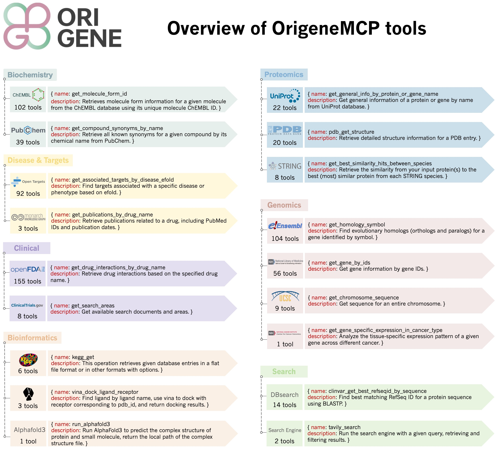

# OrigeneMCP


## 1. OrigeneMCP Overview
OrigeneMCP is the MCP toolkit for the [OriGene](https://github.com/GENTEL-lab/OriGene) project that integrates over **600** tools and multiple databases (including ChEMBL, PubChem, FDA, OpenTargets, NCBI, UniProt, PDB, Ensembl, UCSC, KEGG, STRING, TCGA, Monarch, ClinicalTrials, and more) into an advanced integrated MCP server platform, combining disease biology and drug discovery tools to enable comprehensive multi-dimensional information retrieval across small molecules, proteins, genes, diseases, and other biological entities, serving as a unified interface for accessing and analyzing complex biomedical data to accelerate therapeutic research and development.

## 2. Deploy OrigeneMCP
Clone the repository:

```bash
git clone https://github.com/GENTEL-lab/OrigeneMCP.git
```

The dependencies of this repository are managed by uv. Before deployment, please make sure that uv is already installed. Use the following commands to install uv:


```bash
pip install uv
```

```bash
uv venv .venv --python=3.13
```

Initialize the dependencies of this repository:
```bash
uv sync
```

Deploy the mcp service:
```bash
cp default.conf.toml local.conf.toml
# get your tavily_api_key in https://tavily.com/
# get your jina_api_key in https://jina.ai/

export PYTHONPATH=`fab pypath`
uv run -m deploy.web
```

**NOTE:** 
* Please ensure that port 8788 is not occupied. If it is occupied, please modify the port in file `local.conf.toml` to another port;
* If you need to use Tavily search or Jina search, please configure the `tavily_api_key` or `jina_api_key` in file `local.conf.toml`;

## 3. Use OrigeneMCP
First, connect to OrigeneMCP and get all available tools.

```python
from langchain_mcp_adapters.client import MultiServerMCPClient

# Choose the packages you want to use
tool_packages = [
    "chembl", "kegg", "string", "search", "pubchem", "ncbi",
    "uniprot", "tcga", "ensembl", "ucsc", "fda_drug", "pdb",
    "monarch", "clinicaltrials", "dbsearch", "opentargets"
]

mcp_servers = {
    package: {
        "transport": "streamable_http",
        "url": f"http://127.0.0.1:8788/{package}/mcp/"
    } for package in tool_packages
}

client = MultiServerMCPClient(mcp_servers)
tools = await client.get_tools()
print(f"✅ Found {len(tools)} mcp tools")
tool_map = {tool.name: tool for tool in tools}
```

Let's explore a specific tool's capabilities by examining its description and test cases. As an example, we'll look at the `get_general_info_by_protein_or_gene_name` tool from UniProt, which provides comprehensive protein and gene information:
```python
tool_name = "get_general_info_by_protein_or_gene_name"
tool = tool_map[tool_name]
print(tool.description)
# Get general information of a protein or gene by name from UniProt database.
# Args:
#     name: Protein or gene name.
#     sepcies: Species name.
# ...

```

Set input parameters and call the tool:
```python
query_args = {"query": "TP53"}
result = await tool.ainvoke(query_args)
print(result)
# {
#     "genes": [
#     {
#         "geneName": {
#         "evidences": [
#             {
#             "evidenceCode": "ECO:0000312",
# ...
# }

```


## 4. Use OrigeneMCP through CAMEL
[CAMEL](https://github.com/camel-ai/camel) is an open-source community dedicated to finding the scaling laws of agents. In addition to local invocation, we can also use OrigeneMCP-based Agents through the CAMEL interface.

1. **Install the CAMEL package:**
```bash
pip install camel-ai
```

2. **Set up your OpenAI API key:**
```bash
export OPENAI_API_KEY='your_openai_api_key'
```

3. **Use the CAMEL interface to invoke the OrigeneMCP-based Agent:**
```python
import asyncio

from camel.agents import ChatAgent
from camel.toolkits import OrigeneToolkit

# Choose the packages you want to use
tool_packages = [
    "chembl", "kegg", "string", "search", "pubchem", "ncbi",
    "uniprot", "tcga", "ensembl", "ucsc", "fda_drug", "pdb",
    "monarch", "clinicaltrials", "dbsearch", "opentargets"
]

config = {
    "mcpServers": {
        package: {
            "transport": "streamable_http",
            "url": f"http://127.0.0.1:8788/{package}/mcp/"
        } for package in tool_packages
    }
}

async def main():
    # Use async context manager for automatic connection management
    async with OrigeneToolkit(config_dict=config) as origene_toolkit:
        user_msg = "what can you do?"
        agent = ChatAgent(
            "You are named origene assistant.",
            model="gpt-4o",
            tools=[*origene_toolkit.get_tools()],
        )
        response = agent.step(user_msg)
        print(response.msgs[0].content)

asyncio.run(main())

```

## 4. Cite OrigeneMCP
Any publication that discloses findings arising from using this source code should cite:
```bibtex
@article{origene,
    title={{OriGene}: A Self-Evolving Virtual Disease Biologist Automating Therapeutic Target Discovery},
    author={Zhang, Zhongyue and Qiu, Zijie and Wu, Yingcheng and Li, Shuya and Wang, Dingyan and Zhou, Zhuomin and An, Duo and Chen, Yuhan and Li, Yu and Wang, Yongbo and Ou, Chubin and Wang, Zichen and Chen, Jack Xiaoyu and Zhang, Bo and Hu, Yusong and Zhang, Wenxin and Wei, Zhijian and Ma, Runze and Liu, Qingwu and Dong, Bo and He, Yuexi and Feng, Qiantai and Bai, Lei and Gao, Qiang and Sun, Siqi and Zheng, Shuangjia},
    journal={bioRxiv},
    year={2025},
    publisher={Cold Spring Harbor Laboratory}
}
```
